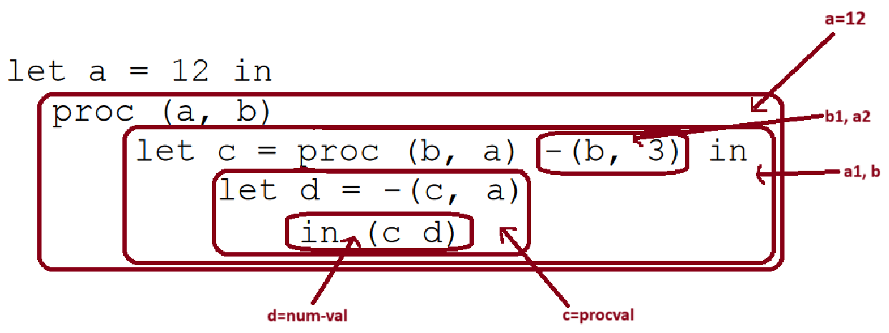
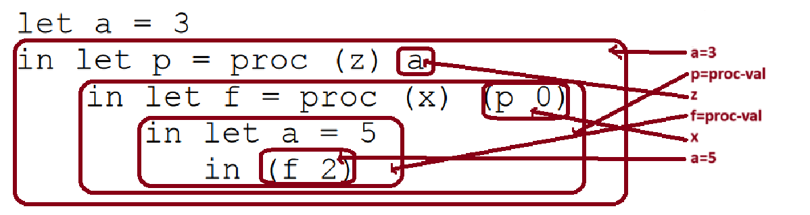

# Problem 1

# Part A

**Declerations:**
- let a = 12
- proc(a, b): a1 and b
- let c = proc-val
- proc(b, a): b1 and a2
- let d = num-val


**References:**
- let d = -(c, a): references c and a from outer scopes
- (c d): references c and d from outer scopes
 
# Part B



**Declerations:**
- let a = 3
- let p = proc-val
- proc (z): z
- let f = proc-val
- proc (x): x
- let a = 5

**References:**
- (f 2): references f from outer scope


----------------------------------------------
# Problem 2
## Part A
```text
%let %nameless-var 6 in 
	%let %nameless-var 4 in
		%let %nameless-var -(#0, #1)
			%let #0 -(#1, #2)
				%let %nameless-var %lexproc %lexproc %lexproc -(#0,-(#1,#2)) in
				(((#3 #0)#1)#2)
```

## Part B
```julia
let a = 13 in 
	let b = 7 in 
		let c = 12 in 
			let f = proc (b ,c) -(b, c) in 
				let d = 5 in 
				-(a, -(d, f))
```


# Problem 3
